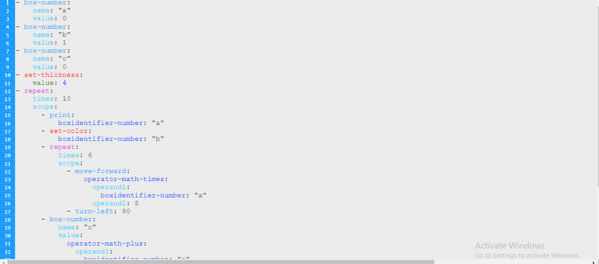

# Google Summer of Code 2022 Final report

## Title - Music Blocks V4 Code Editor

### Organization - Sugarlabs


My task was to make code editor module inside musicblocks-v4. Seeing the code I had to write which would completely be independent
of the project itself, I decided to make a seperate repo and make the code Editor modular which could easily be integrated.
[This link](https://github.com/sugarlabs/musicblocks-v4-code-editor) contains the repo I authored and worked on.

## 📙 Abstract

[MusicBlocks-v4](https://github.com/sugarlabs/musicblocks-v4) is a core visual programming platform that  aims to create an educational programming language for kids.

The goal of the GSoC 2022 project was to create a code editor for musicblocks-v4 which can take user inputs and have features like a status bar, syntax highlighting for the musicblocks-v4 language, code suggestions, syntax-semantic validation, and code prettifier.
There are few features still pending but will be added soon in the not too distant future.

## 📝 Tech Stack

[**`HTML5`**](https://en.wikipedia.org/wiki/HTML5) - for making the code Editor UI and for HTML file used in testing in development and production.

[**`CSS`**](https://en.wikipedia.org/wiki/CSS/) - for css styles of the code editor.

[**`JavaScript`**](https://en.wikipedia.org/wiki/JavaScript) - basically the whole project is written in javascript.

I tried to keep the number of libraries to minimum but we obviously need a lot of libraries for testing and maintaining the code.
so the libraies used for developemnt - 

"devDependencies": {

    "@babel/core": "^7.18.5",
    "@babel/preset-env": "^7.18.2",
    "@sugarlabs/musicblocks-v4-lib": "^0.2.0",
    "babel-loader": "^8.2.5",
    "css-loader": "^6.7.1",
    "eslint": "^8.20.0",
    "html-webpack-plugin": "^5.5.0",
    "jsdoc": "^3.6.10",
    "path": "^0.12.7",
    "style-loader": "^3.3.1",
    "ts-loader": "^9.3.1",
    "typescript": "^4.7.4",
    "webpack": "^5.73.0",
    "webpack-cli": "^4.10.0",
    "webpack-dev-server": "^4.9.3"
},

for production we get a standalone file that can easily be integrated anywhere following few steps.

## ✨ Work Progression

### A Text Editor with a number line
	
#### Ideas tried - 
 - the implementation proposed in the original proposal - 
 The idea was we would have a list of divs inside the main div representing different lines. Inside every div, there will be a \<p> with the line number, \<input> which will be clickable and will take inputs when clicked upon but will be invisible to the user. Below that input, there will be a \<p> which will display whatever the user types, this way we can perform all the stylings for text and take user input creating an illusion of an editable div. A sample code for implementation of the above is in this gist - https://gist.github.com/surajkumar-sk/c4fb5ca69972fa0983ee9f450110517f .


     - The above approach was perfect for making a single line editable and performing all the tasks on a single line. But if we try performing actions like selecting text on multiple lines, copying, pasting, and removing text from multiple lines at one it becomes almost impossible to do. So I had to move to some other approach to make a text editor.

<br/>

  - contentEditable = ”true” approach - 
   The perfect solution to create a text editor. I just had to create a div, add property contenteditable=”true” and add a list of \<p> inside the div where every \<p> represents lines. The div had all the features of a text editor, from editing a single line to performing actions on multiple lines, every line was just a \<p> so we could very easily add \<span> tags around text inside \<p> for code editor features like syntax highlighting, syntax-semantic validation and all other features. Writing the below lines was enough to make a text editor.
    ```
    <div contenteditable="true">
        <p>Hello<span class="d">hello</span> World</p> 
        <p>Hello User</p>
        <p>Displaying Text</p>
    </div>
    ```

      - The problem with the above approach was browsers had a definite way of creating \<p> and any other tags used inside of the text. So if I emit an enter key in the middle of a \<span> tag text, the text gets divided into two \<span> tags one goes on the above \<p> line and the other goes to the next created \<p>. But that is not the behavior I need, so every time a user creates a new line, the browser does the changes that come predefined, then I have to re-run the text analysis and re-write the DOM. Similarly for every action like copying, pasting, deleting text, deleting lines, creating lines, and other input events I had to write a custom logic except the logic for basic key inputs. Upon that the browser executes a predefined task along with my custom tasks and along with that not all the browsers supported the property and the browsers that did had different ways of handling text editing inside the Div. so to avoid performing unnecessary tasks, have support on a range of browsers and be certain about how inputs are being handled I had to think of a different approach. Not convinced yet that contenteditable is bad, try searching “ evil contenteditable “ that will convince you :P.

<br>

- libraries - 
After two failed plans I thought the next best option was to just use a library. There were a lot of libraries out there but all of those libraries had a lot of code for features that would never be used so I was a bit hesitant to use those libraries. So I started digging into those libraries to try to find how they made content editable and styled the text. Realized they made custom tasks for every event inside a text editor from typing and moving the cursor to copying and pasting code(some libraries let copy-paste be handled by the browser).
Libraries I tried - EditArea, CodeMirror, ACE Editor


The idea that worked - 

- making a custom text input div - 
  After digging through libraries I knew I had to create custom logic for every action that can be performed on a text editor. 
   - started with making a moving cursor on line i.e inside a single div, then made the cursor move along multiple lines, then restricted the cursor motion to move only up to the text length on every line.
   - started coding input events like typing text, then coded tasks for backspace, delete and enter key events, which could create and delete lines, split the text into two lines, and other tasks that get performed on a text editor with input keys.
   - Next, it was time to add a number line, and I struggled with getting the styles right. The hardest part was to make the number line sticky horizontally such that it’ll follow the text editor scroll horizontally and never disappears when the user types a long line and scrolls.
   - inputs and number lines were handled now it was time to add higher level features for the text editor like ctrl+a for selecting the text, copying text, pasting text, undoing, and redoing. Selecting text, undoing, and redoing were easy parts. With some difficulty finished up the pasting text task but soon realized a common bug of a browser that while copying a text inside \<p> it copies a line break at the end of \<p> which makes pasting the copied text look like a bug. 
   - i soon realized depending on the browser for selecting text deprives me of having features like removing selected text, properly copying selected text, and removing multiple lines which are very essential features of a text editor, so started coding a custom method for selecting text inside the code editor which gave me complete control over the code editor.
   - with custom text selection copying issue was resolved with features to remove selected lines or text was added. 
   - then coded a lot of other features to support other user behaviors like auto-scrolling and auto-selecting text hidden due to limited width, making the visible area follow the cursor, and many others. 
   - finally listed all the features, started fixing bugs and refactored the code to make it easy for adding new features, understand the code properly, and configured other things to bundle up a single js file to import code editor into any project.

<br>
<br>

### Syntax Highlighting
   
The idea that worked -
	
- After speaking to my GSoC mentor anindhya, I realized the syntax for  musicblocks-v4 is not concrete yet and will be changing a lot. Currently, syntax a bit similar to yml is being used which will be changed later, I started reading more about compilers so I could work with anindhya on the compiler. But soon realized syntax was a very small part of syntax highlighting, the keywords and the colors for the keywords were the ones that mattered not the way in which they are written, so started working on making keywords' colors configurable.

- made a color config JSON, created API for modifying the color config JSON. made APIs to pass specifications snapshot of musicblocks-v4 to get a reference for the keywords and their properties.
- Once I had the color configuration and specifications snapshot figured out, I had to write an algorithm to read a line tag every word in the line into different categories so they could be colored accordingly. It was very frustrating.
- results were quite good - 



<br>
<br>

### Status box of current code containing errors, warnings, and other details - 
<br>

Because of the way I structured and coded the code editor I already had everything I need to make a status box, I had the exact details of cursor position line number and character number, total lines, length of a line, and the way the code was structured it was easy for me to integrate errors and warnings data into the editor. The hardest thing that took a long time was getting the styling and position of the status bar right. 
The sticky property of the number line and the arrangement of the number line with text lines made adding the status bar a lot tough so after trying a range of solutions finally decided to 

- create an upper main div.
- place the code editor code inside the main div.
- create a status bar and place that bar below the code editor inside the main div, making the code editor and status bar two different elements.
- had to make changes to a lot of files to make them target the code editor properly.
- then integrated all the needed information into the status bar.


<br>
<br>

### Intelligent code Suggestions - 

The idea for creating code suggestions was simple - 

- create a list of <p> inside a div with code suggestions(at this stage just some random text).
- make the div with the list follow the cursor and stay below the cursor.
- hide and display the div with the list whenever appropriate.
- when a user is typing a keyword, do a sub-string search inside the specification snapshot and add all the matching keywords into the list and display it.
- then add tasks for moving along the list using arrow keys and replacing text with the text from the suggestion box when the “enter key” is pressed or the list is clicked.

For syntax highlighting the major part of the code was to tag every word of the text and add appropriate colors. But for code suggestions, the major part would be figuring out when to search for keywords and display the list which cannot be done without knowing the syntax. So continued my study for compilers.

<br>
<br>

### Refactoring code and fixing bugs - 

- The next major and boring task was to make the code understandable by adding proper commenting, structuring the code, and following rules to write prettier code.
- Refactored code to reduce repetitions and to reduce hassle while integrating a new feature.

- Fixing bugs - the more I used the code editor the more bugs I found in it, Spent a lot of days trying to fix the bugs.

<br>
<br>

## Future Work -  

- Planing grammar and writing parser for musicblocks-v4 code. 
- Semantic and syntax validation.
- Intelligent code suggestions.
- Code prettifier.
